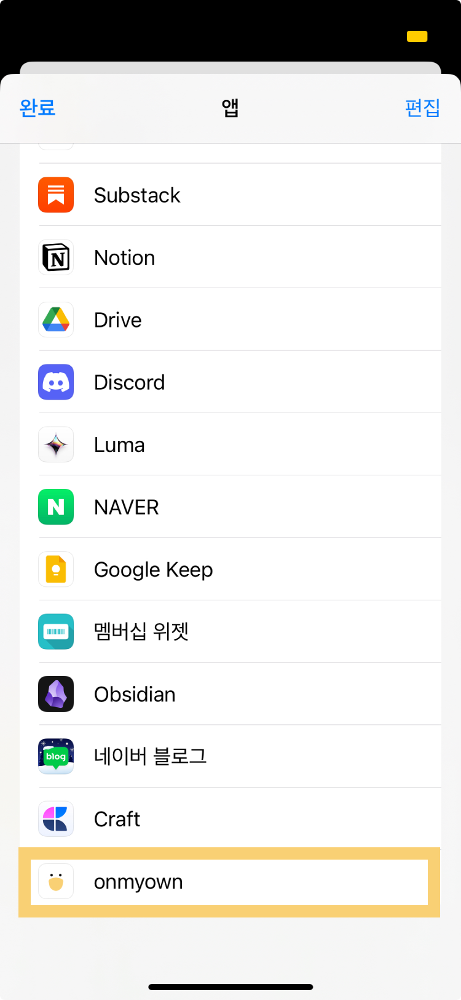

# 핵심 기능

1. 딥링크, share extension 을 이용한 자연스러운 루틴 체크 UX
2. 잠금화면 위젯으로 오늘의 streak 확인
3. 캐릭터 게이미피케이션
4. 캐릭터 네임드랍 공유
5. 친구와 streak 관리

# 설계

앱의 아키텍쳐
iOS - React Native - WebView

# 구현

## share extension 지원

다른 앱에서 공유하기 선택 시,
onmyown 앱으로 공유가 가능하다.

## Apple Login

## UserDefaults 사용을 위한 Native Module

# 레퍼런스

듀오링고 게이미피케이션
